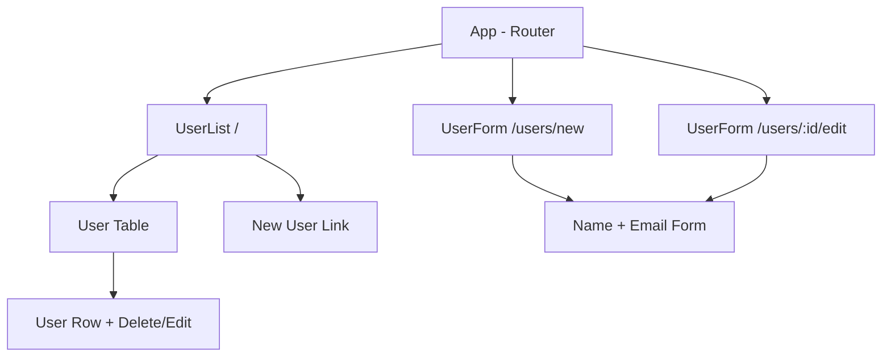
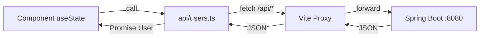

# Design: react-frontend-scaffold

## Approach

Re-initialize the `my-first-project` directory using Vite's official `react-ts` template. Preserve the `.qoder/` and `openspec/` infrastructure directories. Build a simple User management UI that consumes the Spring Boot backend's `/api/users` REST endpoints. Use `fetch` for API calls with a thin typed wrapper — no additional HTTP library. Use React Router for client-side routing. Keep state local to components with `useState`/`useEffect`.

## Architecture

```
my-first-project/
├── .qoder/                    # Preserved
├── openspec/                  # Preserved
├── src/
│   ├── api/
│   │   └── users.ts           # Typed fetch wrapper for /api/users
│   ├── components/
│   │   ├── UserList.tsx        # Table: list, delete, nav to form
│   │   ├── UserList.css
│   │   ├── UserForm.tsx        # Create/edit form
│   │   └── UserForm.css
│   ├── types/
│   │   └── user.ts            # User, CreateUserRequest, UpdateUserRequest interfaces
│   ├── App.tsx                # Router setup with layout
│   ├── App.css
│   ├── main.tsx               # Vite entry point (ReactDOM.createRoot)
│   ├── index.css              # Global styles
│   └── vite-env.d.ts
├── tests/
│   ├── setup.ts               # Vitest setup (import @testing-library/jest-dom)
│   ├── api/
│   │   └── users.test.ts      # API client unit tests (mock fetch)
│   └── components/
│       ├── UserList.test.tsx   # Component renders with mocked API
│       └── UserForm.test.tsx   # Form submission test
├── index.html                 # Vite HTML entry
├── vite.config.ts             # Vite config with proxy + vitest setup
├── tsconfig.json              # Updated for React JSX
├── tsconfig.app.json          # App-specific TS config (Vite convention)
├── package.json
└── .gitignore
```

### Component Hierarchy



### Data Flow



## Data Model

### TypeScript Interfaces (`src/types/user.ts`)

```typescript
export interface User {
  id: number;
  name: string;
  email: string;
}

export interface CreateUserRequest {
  name: string;
  email: string;
}

export interface UpdateUserRequest {
  name?: string;
  email?: string;
}
```

These directly mirror the backend's Java entity and DTO classes.

## API Changes

### Client-side API module (`src/api/users.ts`)

| Function | HTTP | Endpoint | Returns |
|----------|------|----------|---------|
| `getUsers()` | GET | `/api/users` | `Promise<User[]>` |
| `getUserById(id)` | GET | `/api/users/:id` | `Promise<User>` |
| `createUser(data)` | POST | `/api/users` | `Promise<User>` |
| `updateUser(id, data)` | PUT | `/api/users/:id` | `Promise<User>` |
| `deleteUser(id)` | DELETE | `/api/users/:id` | `Promise<void>` |

All functions share a common error handler: if `response.ok` is false, parse the JSON body and throw `new Error(\`${status}: ${message}\`)`.

## Dependencies

| Package | Version | Purpose |
|---------|---------|---------|
| react | ^18.3 | UI library |
| react-dom | ^18.3 | DOM renderer |
| react-router-dom | ^6.26 | Client-side routing |
| typescript | ^5.5 | Type checking (Vite template default) |
| vite | ^5.4 | Build tool + dev server |
| @vitejs/plugin-react | ^4.3 | React Fast Refresh |
| vitest | ^2.0 | Test runner |
| jsdom | ^24.0 | Browser-like test environment |
| @testing-library/react | ^16.0 | Component testing |
| @testing-library/jest-dom | ^6.4 | DOM assertion matchers |
| @testing-library/user-event | ^14.5 | User interaction simulation |

## Risks & Mitigations

| Risk | Impact | Mitigation |
|------|--------|------------|
| `npm create vite` overwrites `.qoder/` or `openspec/` | Loss of workflow infrastructure | Back up directories before init, restore after |
| Vite template uses TypeScript 5.x, project had 7.x | Version mismatch | Accept Vite template defaults; TS 5.x is stable and widely compatible |
| Backend not running during frontend dev | API calls fail, UI shows errors | Vite proxy gracefully returns 502; components show error state |
| CORS issues in production | Frontend can't call backend directly | Not a concern for scaffold (dev proxy handles it); add CORS headers to backend in a future change |

## Alternatives Considered

### Next.js instead of Vite + React
- **Why rejected**: Next.js adds SSR complexity and its own routing convention. For a SPA consuming a separate REST API, Vite is simpler and faster to develop with.

### Axios instead of fetch
- **Why rejected**: `fetch` is built into all modern browsers. For 5 simple endpoints, Axios adds unnecessary bundle size. Can swap later if interceptors or complex error handling is needed.

### Redux/Zustand for state management
- **Why rejected**: Only one resource (User) with simple CRUD. Local component state with `useState` is sufficient. Add a state library when cross-component state sharing becomes complex.
