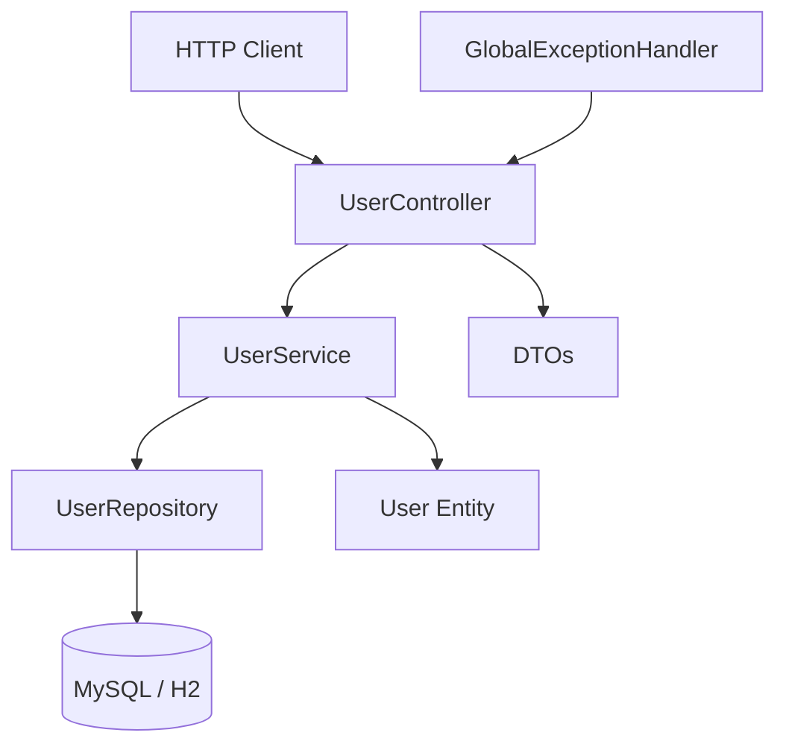

# Design: spring-boot-scaffold

## Approach

Scaffold a standalone Spring Boot 3.3.6 project using Maven, located at `../my-first-project-backend/`. The project uses a layered architecture with a single example entity (`User`) demonstrating full CRUD. Tests run against H2 in-memory database so no MySQL instance is required for the test suite. Development uses a `dev` profile pointing at a local MySQL 8.x instance.

## Architecture

```
my-first-project-backend/
├── .mvn/wrapper/
│   └── maven-wrapper.properties
├── src/
│   ├── main/
│   │   ├── java/com/first/app/
│   │   │   ├── MyApplication.java              # @SpringBootApplication entry point
│   │   │   ├── controller/
│   │   │   │   └── UserController.java         # REST endpoints
│   │   │   ├── service/
│   │   │   │   └── UserService.java            # Business logic
│   │   │   ├── repository/
│   │   │   │   └── UserRepository.java         # Spring Data interface
│   │   │   ├── entity/
│   │   │   │   └── User.java                   # JPA entity
│   │   │   ├── dto/
│   │   │   │   ├── CreateUserRequest.java      # Request DTO
│   │   │   │   └── UpdateUserRequest.java      # Request DTO
│   │   │   └── exception/
│   │   │       ├── ResourceNotFoundException.java
│   │   │       ├── DuplicateEmailException.java
│   │   │       └── GlobalExceptionHandler.java # @RestControllerAdvice
│   │   └── resources/
│   │       ├── application.yml                 # Default config
│   │       ├── application-dev.yml             # MySQL dev profile
│   │       └── application-test.yml            # H2 test profile
│   └── test/
│       └── java/com/first/app/
│           ├── service/
│           │   └── UserServiceTest.java        # Unit tests (Mockito)
│           └── controller/
│               └── UserControllerTest.java     # Integration tests (@WebMvcTest)
├── pom.xml
├── mvnw
├── mvnw.cmd
└── .gitignore
```

### Layer Interaction



### Layer Rules
- **Controller** accepts/returns DTOs, delegates to Service. Never imports Repository.
- **Service** orchestrates business logic, validates constraints (e.g. unique email), converts between Entity and DTO.
- **Repository** extends `JpaRepository<User, Long>`, no custom queries needed initially.
- **Entity** is a pure JPA class with `@Entity`, `@Table`, field annotations.
- **DTO** classes are simple records or Lombok `@Data` classes used only in the controller layer.

## Data Model

### User Entity

| Field   | Type    | Constraints          | Notes                    |
|---------|---------|----------------------|--------------------------|
| id      | Long    | `@Id @GeneratedValue` | Primary key, auto-increment |
| name    | String  | `@NotBlank`          | Required, max 100 chars  |
| email   | String  | `@NotBlank @Column(unique=true)` | Required, unique across all users |

### Table: `users`
```sql
CREATE TABLE users (
    id    BIGINT AUTO_INCREMENT PRIMARY KEY,
    name  VARCHAR(100) NOT NULL,
    email VARCHAR(255) NOT NULL UNIQUE
);
```
(Hibernate generates this automatically via `ddl-auto: update`)

## API Changes

### Endpoints

| Method   | Path              | Request Body           | Success Response        |
|----------|-------------------|------------------------|-------------------------|
| `GET`    | `/api/users`      | —                      | `200` — `User[]`        |
| `GET`    | `/api/users/{id}` | —                      | `200` — `User` / `404`  |
| `POST`   | `/api/users`      | `CreateUserRequest`    | `201` — `User`          |
| `PUT`    | `/api/users/{id}` | `UpdateUserRequest`    | `200` — `User` / `404`  |
| `DELETE` | `/api/users/{id}` | —                      | `204` / `404`           |

### DTOs

**CreateUserRequest**
```json
{ "name": "Alice", "email": "alice@example.com" }
```

**UpdateUserRequest**
```json
{ "name": "Alice Updated", "email": "newalice@example.com" }
```
(both fields optional; only provided fields are updated)

### Error Responses

| Status | Condition                    | Body                                    |
|--------|------------------------------|-----------------------------------------|
| 400    | Validation error             | `{ "message": "...", "errors": [...] }` |
| 404    | User not found               | `{ "message": "User not found with id: X" }` |
| 409    | Duplicate email              | `{ "message": "Email already exists: ..." }` |

## Dependencies

| Dependency                  | Version        | Purpose                           |
|-----------------------------|----------------|-----------------------------------|
| spring-boot-starter-parent  | 3.3.6          | BOM and plugin management         |
| spring-boot-starter-web     | (managed)      | REST, Jackson, embedded Tomcat    |
| spring-boot-starter-data-jpa| (managed)      | Hibernate, Spring Data            |
| spring-boot-starter-validation | (managed)   | `@NotBlank`, `@Valid` support     |
| mysql-connector-j           | (managed)      | MySQL JDBC driver                 |
| lombok                      | (managed)      | `@Data`, `@Builder`, etc.        |
| spring-boot-devtools        | (managed, runtime) | Hot reload during development |
| spring-boot-starter-test    | (managed, test)| JUnit 5, Mockito, MockMvc         |
| h2                          | (managed, test)| In-memory DB for tests            |

## Risks & Mitigations

| Risk | Impact | Mitigation |
|------|--------|------------|
| MySQL not installed locally | Dev environment broken | H2 test profile ensures tests always work; `application-dev.yml` is optional |
| Hibernate `ddl-auto: update` in dev | Accidental schema drift | Acceptable for scaffold; add Flyway in a future change before production |
| Lombok annotation processing not configured | IDE compilation fails | Include `.mvn/wrapper` and document IDE setup; Lombok works out-of-the-box with Maven |
| Duplicate email at DB level vs app level | Race condition on insert | Catch `DataIntegrityViolationException` in `GlobalExceptionHandler` and return 409 |

## Alternatives Considered

### Gradle instead of Maven
- **Why rejected**: User explicitly requested Maven for version management. Gradle has a more flexible DSL but Maven's convention-over-configuration and XML pom is more familiar for Spring Boot scaffolds.

### Spring Data REST (auto-generate endpoints)
- **Why rejected**: Auto-generated endpoints give less control over API shape and error handling. Explicit controller + service layers are more maintainable for a real project.

### Record types instead of Lombok DTOs
- **Why rejected**: Java 17 records work for immutable DTOs but update requests with optional fields are awkward. Lombok `@Data` is more flexible and widely understood. Can revisit when moving to Java 21+.
